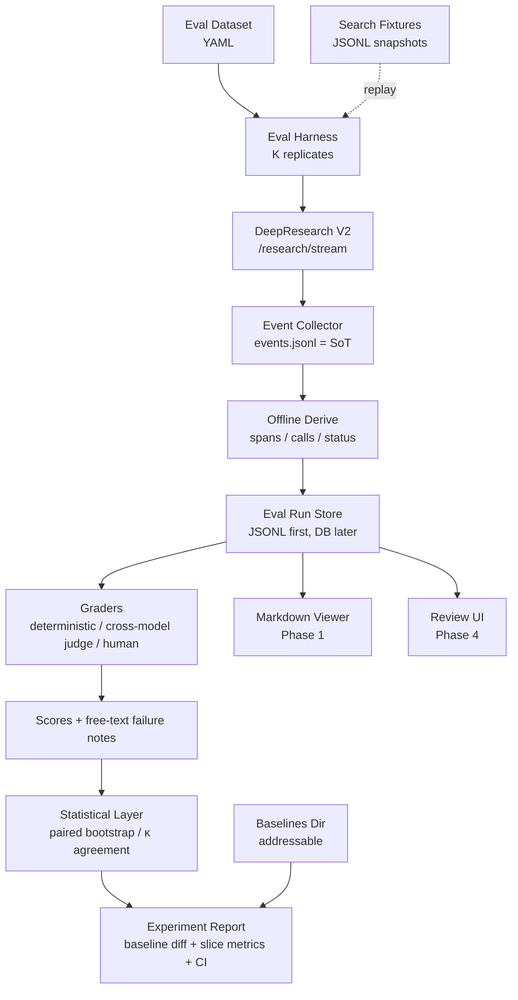

# DeepResearch Eval Platform Design

> 创建：2026-05-07 · 最近更新：2026-05-08（v0.2）
> 状态：Draft v0.2
> 适用：金融广告主 DeepResearch 报告系统评测

## 0. v0.2 相对 v0.1 的变更

v0.1 方向正确，但在四个根本问题上需要补齐：**failure taxonomy 顺序倒置、统计样本量不足、LLM judge 反身性、搜索不可复现**。v0.2 重排路线并补齐数据模型以消解这些风险。

| 关键变更 | 位置 |
|---|---|
| Failure taxonomy 改 open-coding，v0.1 的 13 类降级为 hypothesis-v0 | §9 |
| 每 EvalItem 默认 K=3 replicates；baseline diff 用 paired bootstrap | §6, §10.2 |
| LLM judge 跨模型硬约束（generator ≠ judge），要求 κ ≥ 0.6 | §8.2, §12 |
| Search fixture / replay 模式，experiment 必须锁信源 | §7.6, §12 |
| Phase 1 验收线抬高到 5 × K=3 = 15 trial 全绿，并自带 markdown viewer | §12 |
| 新增 cost / token 字段；数值幻觉 grader；anchor 区间 grader | §7.1, §8.1 |
| events.jsonl 为唯一 SoT，spans 离线派生 | §7.2-7.4, ADR-2 |
| Baseline 目录化、可寻址 | §7.1, §12 Phase 3 |
| failure phase 拆 `first_anomaly_phase` / `root_cause_phase` | §9.3 |

## 1. 背景

当前项目已具备多智能体 DeepResearch 主链路：FastAPI + SSE + DeepResearch V2 状态机 + 多 Agent + checkpoint + 图表 / 知识图谱 / 报告生成。现有 `tests/research_demo.py` 更接近 demo 指标采集，只记录事件数、阶段耗时、少量样本和最终报告摘要。

对于"中信证券广告主 DeepResearch"这类严谨任务，现有 demo 无法回答：

- 失败发生在哪个阶段：planning / researching / analyzing / writing / reviewing / scoring / infrastructure
- 哪个 Agent、哪次 LLM 调用、哪次搜索调用导致质量下降
- 最终报告中的断言是否被信源支持，尤其是数字
- Rubric 评分是否有证据、是否和档位锚点一致
- 模型、prompt、搜索策略、rubric 修改后是否相对 baseline 退化

因此要从"单次 demo 跑通"升级为"可复盘、可比较、可沉淀数据集、且统计可信"的评测闭环。

## 2. 参考方法

- **Anthropic Agent Evals**：Agent 评测需要 task / trial / grader / trace / outcome / harness，关注完整轨迹
- **Hamel Evals FAQ**：先做 error analysis（open coding）再自动化 evaluator；不要一开始追平台
- **Langfuse**：trace / observation / dataset / experiment / score 数据模型
- **Scale Nucleus**：scenario / slice 管理评测集合，看关键失败模式而非总分

参考链接：

- https://www.anthropic.com/engineering/demystifying-evals-for-ai-agents
- https://hamel.dev/blog/posts/evals-faq/
- https://langfuse.com/docs
- https://nucleus.scale.com/docs/creating-scenario-tests

## 3. 设计目标

### 3.1 Goals

| # | 目标 | 验收方式 |
|---|---|---|
| G1 | 建立金融广告主 DeepResearch 标准评测数据集 | YAML 定义 EvalItem，含 query / 广告主 / 场景标签 / 预期能力 / K-replicates 配置 |
| G2 | 完整保存每次 Trial 的 trace | 每次 run 一个独立目录，events.jsonl 为唯一 SoT，append-only |
| G3 | 建立三层 grader 体系 | deterministic / LLM judge（跨模型）/ human review，分开存分数 |
| G4 | 支持统计可信的 baseline diff | 每 item K=3 replicates；baseline 目录化可寻址；diff 用 paired bootstrap 并报告 CI |
| G5 | 支持失败归因 | `first_anomaly_phase`（机检）+ `root_cause_phase`（人工），taxonomy 从 open coding 长出 |
| G6 | 支持后续 UI 平台化 | 数据模型先稳定，Phase 1 即带最小 markdown viewer，Phase 4 再上交互 UI |
| G7 | 成本可追踪 | 每 trial 落 token / api_cost_usd；judge 成本单独统计 |

### 3.2 Non-Goals

| 不做 | 原因 |
|---|---|
| 一开始重建完整 LangSmith / Langfuse | 成本高，当前首要问题是评测闭环和数据质量 |
| 只用一个总分判断质量 | 无法定位失败阶段，不能指导改进 |
| 只保存最终报告 | Agent 系统不可复盘 |
| 把 LLM judge 当唯一真值 | 需要跨模型 judge + 人工校准（κ ≥ 0.6） |
| 用同一 LLM 族既生成又评分 | 同 model family 存在系统性同向偏差，见 §8.2 |
| 接下游广告扰动模型效果评估 | 本项目边界是研究报告与 rubric 评分产出，不验证投放效果 |
| Phase 1 就锁定 failure taxonomy | 违反 bottom-up error analysis 原则，改由 Phase 2 从真实 trace 长出 |

## 4. 核心概念

| 概念 | 含义 |
|---|---|
| EvalDataset | 一组可重复运行的评测用例集合 |
| EvalItem | 单个评测任务（如"中信证券 基本面研究"） |
| Replicate | 同一 EvalItem × 同一 Experiment 的重复运行，默认 K=3，用于估计 LLM/搜索噪声 |
| Scenario Slice | 场景切片，按 advertiser_type / risk_axes / capabilities 三轴正交 |
| Experiment | 一次对 dataset 的批量运行，绑定代码版本、模型、prompt、配置、search 模式（live/replay） |
| Baseline | 被锁定、可寻址的历史 Experiment，diff 基准 |
| Trial | 某个 EvalItem × replicate 的一次实际运行 |
| Trace | Trial 的完整运行轨迹，events.jsonl 为 Source of Truth |
| Span | 从 events 派生的类 Langfuse 观测单元（agent/LLM call/search/code/checkpoint） |
| Artifact | Trial 产物（final_report.md / checkpoint / charts / KG / references） |
| Grade | 自动或人工评测结果，分 deterministic / llm_judge / human 三类 |
| HumanReview | 人工标注、失败归因、批注 |

## 5. 总体架构



Phase 1 的 MVP 即 `Dataset → Harness → Collector → events.jsonl → Derive → Deterministic Grader → Markdown Viewer`。跨模型 judge、统计层、baseline diff 在后续 Phase 接入。

## 6. 数据集设计

### 6.1 EvalItem 结构

评测数据集不应只保存 query，还须保存任务上下文、预期能力、场景切片和已知风险。**scenario_slices 按三轴正交拆分**，便于 slice 报表聚合：

```yaml
id: securities.citic_basic_research.v1
query: "中信证券 基本面研究"
advertiser_name: "中信证券"
advertiser_type: securities              # 轴1：广告主类型
risk_axes:                               # 轴2：已知风险属性
  - entity_confusion_prone               # 主体混淆
  - regulatory_sensitive                 # 监管敏感
  - source_quality_critical              # 信源质量高要求
capabilities_required:                   # 轴3：期望能力
  - identify_advertiser
  - produce_final_report
  - include_D1_to_D5_scores
  - include_evidence_per_dimension
  - include_source_links
  - distinguish_CITIC_Securities_from_CITIC_Group
known_risks_freeform:                    # 自由文本，仅给人工审阅看
  - "混淆中信证券、中信集团、中信银行"
  - "引用财经媒体但缺少公告/财报/监管信源"
  - "D1-D5 评分有分数但缺证据"
replicates: 3                            # K-replicates，默认 3
search_mode: live                        # live | replay:<fixture_id>
```

`capabilities_required` 每个值须在 `graders.yaml` 中映射到具体 grader_id（`identify_advertiser → grader.entity_precision` 等），未映射的字段视为仅供人工审阅，不参与自动评分。

### 6.2 Seed Dataset（Phase 1）

首批 seed dataset 覆盖 5 个金融广告主类型，体现跨类目差异：

| ID | 广告主 | 类型 | 主要风险 |
|---|---|---|---|
| securities.citic_basic_research.v1 | 中信证券 | securities | 主体混淆、监管与财报证据不足 |
| securities.eastmoney_basic_research.v1 | 东方财富证券 | securities | 公司主体和平台业务混淆 |
| bank.cmb_basic_research.v1 | 招商银行 | bank | 银行类 rubric 与证券 baseline 差异 |
| insurance.pingan_basic_research.v1 | 中国平安 | insurance | 集团多业务导致研究边界发散 |
| fund.efunds_basic_research.v1 | 易方达基金 | fund | 信源集中于新闻，缺少基金公告和排名数据 |

### 6.3 Dataset 扩展路线

| Phase | 目标规模 | 用途 |
|---|---|---|
| Phase 1 | 5 条 × K=3 = 15 trial | Harness + deterministic grader 验收 |
| Phase 2 | 30 条（含 original 5） | Error analysis open coding，长出 failure taxonomy |
| Phase 3 | 80+ 条 | Baseline diff 统计稳定；slice-level metric 有样本 |

5 条 seed 不足以支撑 baseline diff 的 signal-to-noise，Phase 3 之前禁止把 5 条结论当作"模型/配置对比"发布。

## 7. Trace 采集设计

每个 Trial 生成一个独立 run 目录，所有记录 append-only。

```text
evals/
  datasets/
    advertiser_research_seed.yaml
  fixtures/
    search/
      2026-05-08-citic-bocha.jsonl         # search 结果快照
  baselines/
    v2.0-rubric-qwen-max/                  # 可寻址 baseline
      baseline_manifest.json
      runs/...                             # 完整 trial dump
  experiments/
    2026-05-08-rubric-v2.1/
      experiment_manifest.json
      runs/
        citic-r1/  citic-r2/  citic-r3/
        cmb-r1/    cmb-r2/    cmb-r3/
        ...
  runs/<YYYY-MM-DD>-<item>-<replicate>/
    run_manifest.json
    events.jsonl                           # SoT，唯一真源
    derived/
      status_timeline.jsonl                # 从 events 派生
      trace_observations.jsonl             # 从 events 派生
      calls.jsonl                          # 从 events 派生
    grades/
      deterministic.json
      llm_judge.json
      human.json
    artifacts/
      final_report.md
      final_checkpoint.json
      references.json
      charts.json
      knowledge_graph.json
    cost.json                              # token / usd 成本
    trial.md                               # 渲染好的人读视图
```

**`derived/` 一律不是 SoT**，可以随时从 events.jsonl 重新生成。events 落盘失败即 trial 失败，这是 collector 的单一职责。

### 7.1 run_manifest.json

```json
{
  "run_id": "uuid-...",
  "trial_id": "citic-r1",
  "dataset_item_id": "securities.citic_basic_research.v1",
  "experiment_id": "2026-05-08-rubric-v2.1",
  "baseline_ref": "baselines/v2.0-rubric-qwen-max@2026-05-04",
  "replicate_index": 1,
  "query": "中信证券 基本面研究",
  "advertiser_name": "中信证券",
  "advertiser_type": "securities",
  "git": { "branch": "main", "commit": "85e2f68", "dirty": false },
  "runtime": {
    "backend_version": "0.1.0",
    "generator_model": "qwen-max",
    "judge_model": "claude-opus-4-7",
    "search_modes": ["web"],
    "search_mode_resolution": "live",
    "max_iterations": 3,
    "temperature": 0.0
  },
  "started_at": "2026-05-07T21:00:00+08:00",
  "finished_at": "2026-05-07T21:24:18+08:00",
  "elapsed_seconds": 1458,
  "final_status": "completed"
}
```

必含字段：run/trial/experiment/baseline/replicate 标识、git、generator/judge model、search 解析结果、起止时间、final_status（completed / failed / timeout / cancelled）。

### 7.2 events.jsonl（Source of Truth）

原始 SSE 事件，唯一真源。每行：

```json
{"seq":1,"timestamp":"2026-05-07T21:00:00+08:00","type":"research_start","payload":{}}
```

Collector 仅负责：
1. 按序落盘每一条 SSE
2. 落盘失败 → trial 立即标记 `final_status=failed`, `failure_kind=collector_error`
3. 不做任何解析 / 裁剪

### 7.3 derived/status_timeline.jsonl（派生）

由离线 `events_to_status.py` 从 events.jsonl 生成。记录 phase 与 checkpoint 状态变化：

```json
{"timestamp":"...","kind":"phase","from":null,"to":"planning"}
{"timestamp":"...","kind":"checkpoint_save","phase":"planning","status":"success","checkpoint_id":"..."}
```

### 7.4 derived/trace_observations.jsonl 与 derived/calls.jsonl（派生）

类 Langfuse span 与跨边界调用：

```json
{"span_id":"span_plan_001","parent_span_id":null,"name":"ChiefArchitect.plan","type":"agent","start_time":"...","end_time":"...","status":"ok"}
```

calls.jsonl 覆盖：

- LLM call：agent、model、temperature、max_tokens、prompt_hash、response_hash、duration_ms、input_tokens、output_tokens、error
- Search call：query、provider、result_count、top_urls、duration_ms、fixture_ref（若 replay）、error
- Code execution：input_summary、code_hash、success、stdout_hash、stderr_hash、duration_ms
- DB / checkpoint：operation、status、duration_ms、error

### 7.5 敏感信息与 prompt/response 存储策略

**决策（不再开放）**：

| 环境 | 策略 |
|---|---|
| 本地 dev（`evals/` 默认 gitignored） | 全文落盘，便于人工审阅 |
| CI / shared / 上传 | 只保留 `prompt_hash` + ≤500 字摘要，全文在 `local_prompts/` 下另存 gitignored |
| 永不落盘 | API key、Authorization header、数据库密码、Cookie |

`no_secret_leak` grader 在 CI 构建产物上再过一遍，防止意外提交。

### 7.6 Search Fixture / Replay

Live search 不可复现是 experiment 控制变量的根本障碍。引入 replay 模式：

- **Live 模式**（默认用于 seed trial）：调用真实 search API，同时把结果快照到 `evals/fixtures/search/<snapshot_id>.jsonl`
- **Replay 模式**（用于 regression、baseline diff）：所有 search 请求按 `(query_normalized, provider)` 哈希命中 fixture，未命中则直接报 `missing_fixture` 错误
- `run_manifest.runtime.search_mode_resolution` 字段显式记录本次 trial 实际用的是哪一种

**规则**：baseline 与被对比 Experiment 必须使用同一批 fixtures；live 对 live 的 diff 不进入正式报告。

### 7.7 cost.json

```json
{
  "llm_input_tokens": 123456,
  "llm_output_tokens": 45678,
  "llm_cost_usd": 1.23,
  "search_call_count": 34,
  "judge_input_tokens": 23456,
  "judge_output_tokens": 8765,
  "judge_cost_usd": 0.42
}
```

没有 cost 字段，Phase 3 experiment 会快速失控。

## 8. Grader 设计

分三层，结果分开存，避免混合。

### 8.1 Deterministic Grader

适合机检项。**原则**：能用 deterministic 的不交给 LLM judge。

| Grader | 判断 | 备注 |
|---|---|---|
| completion_present | 出现 `research_complete` 事件 | |
| final_report_non_empty | 报告非空且 ≥ 阈值长度 | |
| score_table_complete | D1-D5 五维齐全 | 注：生产代码的 pydantic schema 也应保证，grader 是兜底 |
| score_range_valid | 每个 score ∈ [0, 100] | 同上 |
| score_in_anchor_band | 每个分数落在所选 anchor 档位区间内 | 新增，rubric_consistency 的可机检部分 |
| evidence_count_per_dim | 每维度 ≥ N 条 evidence 或显式标"数据不足" | 新增 |
| evidence_present | 每维度存在 evidence 段 | |
| reference_links_present | 引用 URL 存在且可解析 | |
| numeric_claim_groundedness | 报告中的数字在 references 全文可 grep 到 | **金融场景 critical**，见 §8.4 |
| no_secret_leak | 无 key / token / password | |
| checkpoint_completed | checkpoint 最终状态为 completed | |
| first_anomaly_phase | 最早出现异常事件的 phase（不写 pass/fail，只给分类字段） | 见 §9.3 |

Deterministic grader 输出 binary pass/fail + 量化细节，存 `grades/deterministic.json`。

### 8.2 LLM Judge Grader（跨模型硬约束）

**硬约束**：judge 模型必须与 generator 模型不同族。本项目 generator 默认 Qwen-Max（DashScope），judge 默认 Claude Opus / GPT-4 级别。理由：同族 model 对自己产出的 rubric 评分存在系统性同向偏差，得不到独立判断。

`run_manifest.runtime.generator_model` 与 `.judge_model` 必须不同；相同时 harness 拒绝启动。

| Grader | 判断 | 可被部分 deterministic 替代 |
|---|---|---|
| groundedness | 关键断言被信源支持 | 数字部分由 `numeric_claim_groundedness` 先过 |
| coverage | 覆盖业务扩张、监管态度、品牌活跃、竞争地位、数字化创新 | |
| source_quality | 优先使用财报 / 公告 / 监管 / 交易所 / 权威媒体 | |
| rubric_consistency | reasoning 与分数、档位、证据自洽 | anchor 区间由 `score_in_anchor_band` 先过 |
| synthesis_quality | 形成研究判断而非资料堆砌 | |
| entity_precision | 准确聚焦目标广告主 | |

LLM judge 输出 schema：

```json
{
  "grader_id": "groundedness",
  "score": 0,
  "pass": false,
  "rationale": "...",
  "cited_evidence": ["ref_id_1", "ref_id_2"],
  "uncertainty": "low | medium | high",
  "suggested_failure_label": "自由文本，Phase 2 open coding 聚合"
}
```

Judge 自评 uncertainty=high 的条目不进入 Experiment 聚合分，只进入 human review 队列。

### 8.3 Human Review

人工评审是 LLM judge 的真值锚。至少标注：

- `pass | fail | needs_review`
- `first_anomaly_phase`（机检值的确认或覆盖）
- `root_cause_phase`（人工唯一定字段）
- `failure_label`：**Phase 1-2 自由文本**，Phase 3 起可引用 stable taxonomy id
- `severity: critical | major | minor`
- `reviewer_notes`
- `should_add_to_regression: true | false`

### 8.4 数值幻觉 grader（numeric_claim_groundedness）

金融报告里"中信证券 2025 营收 651 亿"这类断言错了即报告报废。设计：

1. 正则 / NER 从 final_report 抽出数字断言：`(主体, 指标, 数值, 单位, 时间范围)`
2. 对每条断言，在 `references.json` 全文 / source_tracing 快照里做近似匹配（允许单位规范化，如"亿"↔"100M"）
3. 未命中 → `grader_numeric_claim_groundedness.unmatched_claims[]`
4. 阈值：unmatched / total > 5% 判 fail

成本主要是 NER，不走 LLM judge，因此预算可控。

## 9. Failure Taxonomy（bottom-up）

### 9.1 核心原则

v0.1 自上而下锁 13 类违反 Hamel 的核心建议。**改为 open coding**：

- **Phase 1**：人工审阅只写 `failure_label_freeform`（自由文本），不受词表约束
- **Phase 2**：累计 ≥ 30 条 trace 后做 axial coding，把相似标签聚合为稳定 taxonomy `v1`
- **Phase 3** 起：`failure_type_id` 引用 taxonomy v1，但仍允许 `failure_label_freeform` 并存，作为 v2 演进输入

### 9.2 Hypothesis-v0 词表（仅供参考，不进数据）

下表是 v0.1 遗留的假设词表，保留用于 reviewer 提示，不作为评测字段的枚举值：

| 类型（hypothesis） | 描述 |
|---|---|
| planning.entity_confusion | 广告主主体识别错误或混淆 |
| planning.bad_outline | 大纲不符合金融广告主基本面研究 |
| research.low_source_quality | 信源质量低，缺少官方 / 财报 / 监管材料 |
| research.low_recall | 关键事实缺失 |
| research.stale_information | 使用过时信息且未标注时间 |
| analysis.chart_invalid | 图表数据不足、错误或无法解释 |
| writing.unsupported_claim | 报告断言缺少证据 |
| writing.numeric_hallucination | 数字与来源不一致 |
| writing.poor_synthesis | 资料堆砌没有判断 |
| review.missed_issue | Critic 未发现明显问题 |
| scoring.missing_dimension | D1-D5 缺失 |
| scoring.evidence_mismatch | 分数与证据不匹配 |
| scoring.anchor_violation | 分数不在所选档位区间 |
| infrastructure.timeout | 超时或 SSE 中断 |
| infrastructure.checkpoint_error | checkpoint 保存或状态更新异常 |

### 9.3 失败 phase 拆两个字段

v0.1 的 `first_failure_phase` 语义模糊（最早可观测 vs 最早可归因），v0.2 拆为：

| 字段 | 语义 | 由谁产出 |
|---|---|---|
| `first_anomaly_phase` | 最早出现 **可机检异常** 的 phase（错误事件、checkpoint 失败、grader fail 最早归属） | deterministic grader 自动 |
| `root_cause_phase` | 最早 **可归因** 的 phase（常需阅读前文 context） | 人工 review |

两者可以不同：research 阶段信源质量差，但 writing 阶段才显化为 unsupported claim，`first_anomaly` 可能是 writing，`root_cause` 是 research。

## 10. 指标体系

### 10.1 单 Trial 指标

- `final_status`
- `elapsed_seconds`
- `total_events`
- `phase_timings_seconds`
- `llm_call_count` / `search_call_count` / `code_exec_count`
- `references_count` / `official_source_count`
- `final_report_length`
- `deterministic_pass_rate`
- `llm_judge_overall_score`（跨维度加权平均）
- `first_anomaly_phase`
- `cost_usd`（含 judge）
- `search_mode_resolution`：live | replay
- `judge_high_uncertainty_ratio`：判别 judge 自信度

### 10.2 Experiment 指标（统计可信）

Experiment 聚合必须给出 **点估计 + 置信区间**。K=3 replicates 时用 paired bootstrap：

- `pass@1`（per-item 平均后再跨 item 平均，含 95% CI）
- `timeout_rate` / `infrastructure_failure_rate`
- `average_latency` / `average_cost_usd`
- `average_source_quality_score` / `average_groundedness_score` / `average_rubric_consistency_score`
- Slice-level score：按 `advertiser_type` / `risk_axes` / `capabilities_required` 三轴分别聚合
- **Baseline diff**：与 `baseline_ref` 配对 bootstrap 比较（同 item 同 replicate-index 配对），输出：
  - `delta_mean` + 95% CI
  - `p_value`（Wilcoxon signed-rank）
  - `regression_items[]`：显著下降的 item 列表
- **Judge-Human agreement**：每个 LLM judge 维度给 `cohen_kappa`，< 0.4 的 grader 在报告中标记 **unstable**，不参与聚合

### 10.3 不进报告的反模式

- 不用 naive mean 差值当"baseline diff 结论"
- 不在 N < 30 时报告 slice-level 显著性
- 不在 live 对 live 的两次 run 之间做 diff

## 11. 中信证券首个 Seed Trial 标准

中信证券 `基本面研究` 作为第一条正式 seed trial，而非普通 demo。

### 11.1 最低合格线（deterministic）

- `research_complete` 出现
- `final_report` 非空且长度达标
- D1-D5 评分齐全
- 每个维度 ≥ 1 条 evidence，或明确标注"数据不足"
- 引用链接存在且可追溯
- `numeric_claim_groundedness` 未命中比例 ≤ 5%
- 不混淆"中信证券"与"中信集团 / 中信银行"（由 `entity_precision` grader 过）
- checkpoint 最终状态 completed；失败必须有 error reason
- 全量 trace 可通过 `evals/render.py` 渲染为单文件 `trial.md`

### 11.2 人工重点检查（human review）

- 是否引用中信证券年报、公告、交易所 / 证监会 / 自律协会材料
- 监管态度评分是否把一般新闻误当作监管利好或监管危机
- 竞争地位是否有同业对比，而不是只写公司自述
- 创新与数字化是否有明确产品、技术投入或数字化业务证据

### 11.3 K-replicates 稳定性

中信证券 seed 跑 K=3，要求：

- 3 次 `final_status` 全部 completed
- 3 次 D1-D5 总分极差 ≤ 15（超出提示 rubric 不稳定，需 Phase 2 调 prompt）
- 3 次 `first_anomaly_phase` 一致或 None

## 12. 分阶段路线

### Phase 1：本地 Eval Harness 与 Markdown Viewer

**产出**：

- `evals/datasets/advertiser_research_seed.yaml`（5 条）
- `evals/harness.py`：单 case / K replicates 运行器
- Event collector（events.jsonl SoT，append-only）
- `evals/events_to_spans.py`（离线派生 status / observations / calls）
- Deterministic graders 全量（§8.1）
- `evals/render.py`：把一个 run 目录渲染成单文件 `trial.md`（trace tree + final report + grades）
- `cost.json` 记录
- Gitignore：`evals/runs/`、`evals/fixtures/`、`local_prompts/`

**验收（硬线）**：

- 5 条 seed × K=3 = 15 trial 全部 `final_status=completed`
- Deterministic grader 覆盖率 100%，且 15 trial 中 pass 率可报告
- 随机抽 1 个 trial，人工在 ≤ 5 分钟内能通过 `trial.md` 完成复盘
- Search fixture 机制可工作（能至少 replay 一次中信证券 trial）

### Phase 2：Error Analysis 与跨模型 LLM Judge

**产出**：

- ≥ 30 条 trace 的人工审阅记录（含 freeform labels）
- 由 freeform labels 聚合的 `failure_taxonomy_v1.yaml`
- Cross-model LLM judge prompt + schema（generator=Qwen-Max，judge=Claude/GPT）
- 每维度 judge 与人工的 Cohen's κ 报告

**验收**：

- Taxonomy v1 来自真实 trace，覆盖 ≥ 90% 的观察到的失败
- 每个 LLM judge 维度 κ ≥ 0.6；κ < 0.4 的 grader 停用并标记
- Judge 成本 / trial 在预算内（建议 ≤ $0.5/trial）

### Phase 3：Experiment 对比与 Statistical Layer

**产出**：

- `evals/baselines/<name>/` 首个锁定 baseline
- Dataset 扩展到 80+ 条
- `evals/stats.py`：paired bootstrap、Wilcoxon、Cohen's κ
- Slice-level report（advertiser_type × risk_axes × capabilities）
- `scripts/eval_smoke.sh`（CI，10 min，deterministic-only）与 `scripts/eval_nightly.sh`（全 grader + replay）

**验收**：

- 任意 prompt / model / rubric / search 策略变更能回答"相对 baseline 是否变好、变差、差在哪里"
- 报告默认包含 95% CI 与 p-value
- CI smoke test 在 main 分支合并前自动运行

### Phase 4：评测查看器（UI）

**产出**：

- Trace / span 树可视化
- 最终报告 + 引用 + charts 联动
- Grader 分数与人工批注
- dataset / experiment / slice 过滤
- Baseline diff 可视化

**验收**：无需看原始 JSONL，也能完成一次人工评审。

### Phase 5：平台化或接入 Langfuse

**决策点**：

- 目标是工程效率和成熟 observability → 优先接入 Langfuse（**自托管**，考虑 GFW 与数据合规）
- 目标是项目展示、领域定制、学习评测系统 → 自建轻量平台
- 所选路径须保留 §7 的数据模型作为导入源

## 13. ADR（关键决策记录）

### ADR-1 · Failure taxonomy 不预先锁定

- **决策**：Phase 1 用 freeform，Phase 2 从 ≥ 30 条 trace 做 axial coding 长出 v1
- **理由**：v0.1 的 13 类是先验猜测；Hamel 明确反对这种做法
- **影响**：失败分析初期效率低于预期，但换来 taxonomy 与真实 failure modes 对齐

### ADR-2 · events.jsonl 为唯一 Source of Truth

- **决策**：status / observations / calls 全部从 events 离线派生
- **理由**：双写运行时一致性无法保证，丢数据即不可复盘
- **影响**：collector 代码极简，派生逻辑可独立演化、可回放重建

### ADR-3 · Judge 与 Generator 必须跨 model family

- **决策**：Harness 硬校验 generator_model ≠ judge_model（且不同 family）
- **理由**：同 family 存在系统性同向偏差，LLM judge 降级为 echo chamber
- **影响**：judge 成本略升；需维护两家 API 密钥

### ADR-4 · Search 引入 fixture replay，baseline diff 强制 replay

- **决策**：baseline 与被对比 experiment 必须使用相同 fixture；live 对 live 不进正式报告
- **理由**：live search 漂移会把 prompt 变更的归因污染
- **影响**：需要一套 fixture 管理工具与存储成本

### ADR-5 · Schema 校验归生产代码，评测层做兜底

- **决策**：D1-D5 存在性、分数区间等 schema 校验在 `scoring_service` pydantic 层 reject；grader 只作为兜底
- **理由**：让生产先崩，比让 grader 默默标 fail 更有价值
- **影响**：需要 `scoring_service` 先实现 strict schema（v2 spec 已有）

## 14. 开放问题

1. Taxonomy v1 产出节奏：Phase 2 的 30 条阈值是否足够？若 failure 分布长尾，是否应提升到 50 条？
2. 数值幻觉 grader 的 NER：使用现有 LLM 抽实体（低成本但非 deterministic）还是专用模型？
3. HumanReview 是否引入多人标注与一致性统计（一致率 < 0.7 的 item 进入 discussion）？
4. Phase 5 若选 Langfuse，自托管 docker compose 是否纳入 `docker-compose.yml` 还是独立 compose？
5. CI eval_smoke 的 5 条子集策略：固定 5 条 vs 随机 5 条，取舍？

## 15. 推荐执行顺序

1. 先建 trace collector + events.jsonl + markdown viewer（Phase 1 骨架）
2. 上 deterministic grader 与 cost 字段
3. 中信证券跑第一条 K=3 trial，达到 §11 全部合格线
4. 扩展到 5 条 seed × K=3
5. 进入 Phase 2：freeform 人工审阅 30 条 → 长出 taxonomy v1
6. 再上跨模型 LLM judge，测 κ
7. 最后决定自建 UI 或接入 Langfuse

不要在 Phase 1 提前做 UI、不要在 Phase 2 前锁 taxonomy、不要在 Phase 3 前把 5 条结论当作 baseline diff。这三条是本设计的核心自律。
