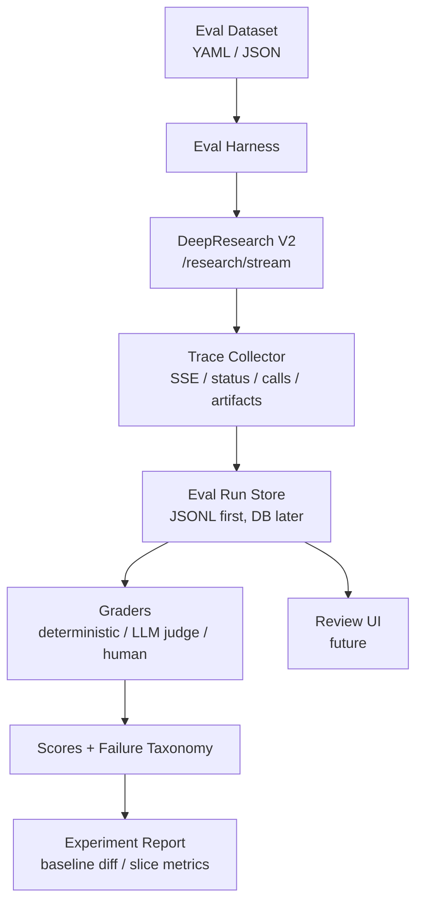

# DeepResearch Eval Platform Design

> 创建日期：2026-05-07
> 状态：Draft，待 Claude / 用户进一步评审
> 适用范围：金融广告主 DeepResearch 报告系统评测

## 1. 背景

当前项目已经具备多智能体 DeepResearch 主链路：FastAPI + SSE + DeepResearch V2 状态机 + 多 Agent + checkpoint + 图表 / 知识图谱 / 报告生成。现有 `tests/research_demo.py` 更接近 demo 指标采集，只记录事件数、阶段耗时、少量事件样本和最终报告摘要。

对于“中信证券广告主 DeepResearch”这类严谨分析任务，现有 demo 测试不足以回答以下问题：

- 失败发生在哪个阶段：planning / researching / analyzing / writing / reviewing / scoring / infrastructure。
- 哪个 Agent、哪次 LLM 调用、哪次搜索调用导致质量下降。
- 最终报告中的断言是否被信源支持。
- Rubric 评分是否有证据、是否和档位锚点一致。
- 模型、prompt、搜索策略、rubric 修改后是否相对 baseline 退化。

因此需要从“单次 demo 跑通”升级为“可复盘、可比较、可沉淀数据集的评测闭环”。

## 2. 参考方法

本设计参考以下评测方法与平台形态：

- Anthropic Agent Evals：Agent 评测需要 task、trial、grader、trace、outcome、harness，并关注 agent 的完整轨迹而非只看最终答案。
- Hamel Evals FAQ：先做 error analysis，再自动化 evaluator；不要一开始只追求复杂平台。
- Langfuse：trace / observation / dataset / experiment / score 是成熟的 LLM observability 与 eval 数据模型。
- Scale Nucleus：用 scenario / slice 管理评测集合，按关键场景看失败模式，而不是只看总分。

参考链接：

- https://www.anthropic.com/engineering/demystifying-evals-for-ai-agents
- https://hamel.dev/blog/posts/evals-faq/
- https://langfuse.com/docs
- https://nucleus.scale.com/docs/creating-scenario-tests

## 3. 设计目标

### 3.1 Goals

| # | 目标 | 验收方式 |
|---|---|---|
| G1 | 建立金融广告主 DeepResearch 的标准评测数据集 | 可用 YAML / JSON 定义 EvalItem，包含 query、广告主、场景标签、预期要求 |
| G2 | 完整保存每次运行的 trace | 每次 run 生成 append-only JSONL，覆盖 SSE、phase、status、checkpoint、agent span、调用记录 |
| G3 | 建立 Grader 分层体系 | deterministic grader、LLM judge、human review 分开记录 |
| G4 | 支持 baseline 对比 | 同一 dataset 可跨模型、prompt、rubric、搜索策略做 experiment diff |
| G5 | 支持失败归因 | 每次失败可标注 first failure phase 和 failure taxonomy |
| G6 | 支持后续 UI 平台化 | 数据模型先稳定，后续可做类 LangSmith / Langfuse 的评测查看器 |

### 3.2 Non-Goals

| 不做 | 原因 |
|---|---|
| 一开始重建完整 LangSmith / Langfuse | 成本高，且当前首要问题是评测闭环和数据质量 |
| 只用一个总分判断质量 | 无法定位失败阶段，也无法指导改进 |
| 只保存最终报告 | 对 Agent 系统不可复盘 |
| 把 LLM judge 当唯一真值 | 需要人工 error analysis 校准 |
| 接下游广告扰动模型效果评估 | 本项目边界是研究报告与 rubric 评分产出，不验证业务投放效果 |

## 4. 核心概念

| 概念 | 含义 |
|---|---|
| EvalDataset | 一组可重复运行的评测用例集合 |
| EvalItem | 单个评测任务，例如“中信证券 基本面研究” |
| Scenario Slice | 场景切片，例如 securities、regulatory_sensitive、rubric_scoring |
| Experiment | 一次对 dataset 的批量运行，绑定代码版本、模型、prompt、配置 |
| Trial | 某个 EvalItem 的一次实际运行 |
| Trace | Trial 的完整运行轨迹 |
| Observation / Span | Trace 中的阶段、Agent、LLM 调用、搜索调用、代码执行等可观测单元 |
| Artifact | Trial 产物，例如 final_report.md、checkpoint dump、图表、KG |
| Grade | 自动或人工评测结果 |
| HumanReview | 人工标注、失败归因、批注 |

## 5. 总体架构



第一阶段优先建设 Eval Harness 和本地文件型 Run Store；UI 与数据库化平台放到后续阶段。

## 6. 数据集设计

评测数据集不应只保存 query，而应保存任务上下文、预期要求、场景切片和已知风险。

示例：

```yaml
id: securities.citic_basic_research.v1
query: "中信证券 基本面研究"
advertiser_name: "中信证券"
advertiser_type: "securities"
scenario_slices:
  - single_advertiser
  - securities
  - regulatory_sensitive
  - rubric_scoring
known_risks:
  - "混淆中信证券、中信集团、中信银行"
  - "引用财经媒体但缺少公告/财报/监管信源"
  - "D1-D5 评分有分数但缺证据"
expected_requirements:
  - identify_advertiser_correctly
  - produce_final_report
  - include_D1_to_D5_scores
  - include_evidence_per_dimension
  - include_source_links
  - avoid_confusing_CITIC_Securities_with_CITIC_Group
```

首批 seed dataset 建议包含 5 个广告主：

| ID | 广告主 | 类型 | 主要风险 |
|---|---|---|---|
| securities.citic_basic_research.v1 | 中信证券 | 证券 | 主体混淆、监管与财报证据不足 |
| securities.eastmoney_basic_research.v1 | 东方财富证券 | 证券 | 公司主体和平台业务混淆 |
| bank.cmb_basic_research.v1 | 招商银行 | 银行 | 银行类 rubric 与证券 baseline 差异 |
| insurance.pingan_basic_research.v1 | 中国平安 | 保险 | 集团多业务导致研究边界发散 |
| fund.efunds_basic_research.v1 | 易方达基金 | 基金 | 信源集中于新闻，缺少基金公告和排名数据 |

## 7. Trace 采集设计

每次 Trial 生成一个独立 run 目录，所有记录 append-only 保存。

建议目录结构：

```text
evals/
  datasets/
    advertiser_research_seed.yaml
  runs/
    2026-05-07-citic-securities/
      run_manifest.json
      events.jsonl
      status_timeline.jsonl
      trace_observations.jsonl
      calls.jsonl
      grades.json
      artifacts/
        final_report.md
        final_checkpoint.json
        references.json
        charts.json
        knowledge_graph.json
```

### 7.1 run_manifest.json

必须记录：

- run_id / trial_id / dataset_item_id / session_id
- query / advertiser_name / advertiser_type
- git branch / commit hash / dirty status
- backend version、model config、search_modes、max_iterations
- started_at / finished_at / elapsed_seconds
- final_status：completed / failed / timeout / cancelled

### 7.2 events.jsonl

保存原始 SSE 事件。每行一条事件：

```json
{"seq":1,"timestamp":"2026-05-07T21:00:00+08:00","type":"research_start","payload":{}}
```

### 7.3 status_timeline.jsonl

保存状态变化，不被 checkpoint 覆盖：

```json
{"timestamp":"...","kind":"phase","from":null,"to":"planning"}
{"timestamp":"...","kind":"checkpoint_save","phase":"planning","status":"success","checkpoint_id":"..."}
{"timestamp":"...","kind":"checkpoint_status","from":"running","to":"completed"}
```

### 7.4 trace_observations.jsonl

保存类 Langfuse / LangSmith 的 span：

```json
{"span_id":"span_plan_001","parent_span_id":null,"name":"ChiefArchitect.plan","type":"agent","start_time":"...","end_time":"...","status":"ok"}
```

### 7.5 calls.jsonl

保存跨边界调用：

- LLM call：agent、model、temperature、max_tokens、prompt_hash、response_hash、duration_ms、error
- Search call：query、provider、result_count、top_urls、duration_ms、error
- Code execution：input_summary、code_hash、success、stdout_hash、stderr_hash、duration_ms
- DB/checkpoint：operation、status、duration_ms、error

敏感信息不落盘：API key、Authorization header、数据库密码必须脱敏。

## 8. Grader 设计

Grader 分三层，结果分开保存，避免把不同性质的判断混在一个总分里。

### 8.1 Deterministic Grader

适合确定性检查：

| Grader | 判断 |
|---|---|
| completion_present | 是否出现 research_complete |
| final_report_non_empty | final_report 是否非空且长度超过阈值 |
| score_table_complete | 是否包含 D1-D5 五个维度 |
| score_range_valid | 每个 score 是否在 0-100 |
| evidence_present | 每个维度是否有 evidence 或数据不足说明 |
| reference_links_present | 引用 URL 是否存在 |
| no_secret_leak | 是否泄露 key/token/password |
| checkpoint_completed | checkpoint 最终状态是否 completed |

### 8.2 LLM Judge Grader

适合语义质量判断：

| Grader | 判断 |
|---|---|
| groundedness | 关键断言是否被信源支持 |
| coverage | 是否覆盖业务扩张、监管态度、品牌活跃、竞争地位、数字化创新 |
| source_quality | 是否优先使用财报、公告、监管、交易所、权威媒体 |
| rubric_consistency | 分数、档位、证据、reasoning 是否一致 |
| synthesis_quality | 是否形成研究判断，而非简单资料堆砌 |
| entity_precision | 是否准确聚焦目标广告主 |

LLM judge 输出必须包含：

- score：0-100
- pass：true / false
- rationale
- cited_evidence
- uncertainty
- suggested_failure_type

### 8.3 Human Review

人工评审用于校准自动 grader。至少标注：

- pass / fail / needs_review
- first_failure_phase
- failure_type
- severity：critical / major / minor
- reviewer_notes
- should_add_to_regression：true / false

## 9. Failure Taxonomy

初始失败分类：

| 类型 | 描述 |
|---|---|
| planning.entity_confusion | 广告主主体识别错误或混淆 |
| planning.bad_outline | 大纲不符合金融广告主基本面研究 |
| research.low_source_quality | 信源质量低，缺少官方 / 财报 / 监管材料 |
| research.low_recall | 关键事实缺失 |
| research.stale_information | 使用过时信息且未标注时间 |
| analysis.chart_invalid | 图表数据不足、错误或无法解释 |
| writing.unsupported_claim | 报告断言缺少证据 |
| writing.poor_synthesis | 只是堆砌资料，没有判断 |
| review.missed_issue | Critic 未发现明显问题 |
| scoring.missing_dimension | D1-D5 缺失 |
| scoring.evidence_mismatch | 分数和证据不匹配 |
| infrastructure.timeout | 超时或 SSE 中断 |
| infrastructure.checkpoint_error | checkpoint 保存或状态更新异常 |

## 10. 指标体系

### 10.1 单 Trial 指标

- final_status
- elapsed_seconds
- total_events
- phase_timings_seconds
- llm_call_count
- search_call_count
- references_count
- official_source_count
- final_report_length
- deterministic_pass_rate
- llm_judge_overall_score
- first_failure_phase

### 10.2 Experiment 指标

- pass@1
- timeout_rate
- infrastructure_failure_rate
- average_latency
- average_source_quality_score
- average_groundedness_score
- average_rubric_consistency_score
- slice-level score：按 advertiser_type / scenario_slices 聚合
- baseline diff：相对上一版配置的分数变化

## 11. 中信证券首个 Seed Trial 标准

`中信证券 基本面研究` 不应再作为普通 demo，而应作为第一条正式 seed trial。

最低合格线：

- `research_complete` 出现。
- `final_report` 非空且长度达标。
- D1-D5 评分全部存在。
- 每个评分维度至少 1 条证据，或明确标注“数据不足”。
- 引用链接存在且可追溯。
- 不混淆“中信证券”和“中信集团 / 中信银行”。
- checkpoint 最终状态为 completed；失败时必须有 error reason。
- 全量 trace 可复盘到每个 phase 和关键调用。

建议人工重点检查：

- 是否引用中信证券年报、公告、交易所 / 证监会 / 自律协会材料。
- 监管态度评分是否把一般新闻误当作监管利好或监管危机。
- 竞争地位是否有同业对比，而不是只写公司自述。
- 创新与数字化是否有明确产品、技术投入或数字化业务证据。

## 12. 分阶段路线

### Phase 1：本地 Eval Harness

产出：

- `evals/datasets/advertiser_research_seed.yaml`
- 单 case 运行器
- JSONL trace 采集
- deterministic graders
- `grades.json`

验收：中信证券 seed trial 可完整保存并自动生成基础评测结果。

### Phase 2：Error Analysis 与 LLM Judge

产出：

- 20-50 条人工审阅 trace
- failure taxonomy 修订版
- LLM judge prompt
- judge 与人工标签一致性分析

验收：LLM judge 不作为真值，但能稳定辅助定位 groundedness / coverage / rubric consistency 问题。

### Phase 3：Experiment 对比

产出：

- baseline run 固化
- prompt / model / rubric / search strategy diff
- slice-level report

验收：任意改动能回答“相对 baseline 是否变好、变差、差在哪里”。

### Phase 4：评测查看器

产出：

- Trace/span 树
- 最终报告和引用查看
- grader 分数与人工批注
- dataset / experiment / slice 过滤

验收：无需看原始 JSONL，也能完成一次人工评审。

### Phase 5：平台化或接入 Langfuse

决策点：

- 如果目标是工程效率和成熟 observability，优先接入 Langfuse。
- 如果目标是项目展示、领域定制和学习评测系统，可以自建轻量平台。

## 13. 开放问题

1. 是否把 evals 作为项目内长期目录，还是放入 `docs/generated/` 或独立实验目录。
2. LLM prompt / response 是否保存全文，还是默认 hash + 摘要，全文只在本地私有目录保存。
3. 第一批 dataset 是只覆盖金融广告主，还是也保留旧的行业研究 case 作为回归样本。
4. 是否引入 Langfuse 作为后续 trace backend。
5. HumanReview 是否需要多人标注与一致性统计。

## 14. 推荐决策

建议采用“能力先于平台 UI”的路线：

1. 先建设 trace + dataset + deterministic grader 的本地闭环。
2. 用中信证券跑第一条完整 seed trace。
3. 人工审阅 20-50 条 trace，形成 failure taxonomy。
4. 再固化 LLM judge。
5. 最后决定自建 UI 或接入 Langfuse。

该路线能最大限度避免过早平台化，同时保留未来演进为完整评测平台的结构。
