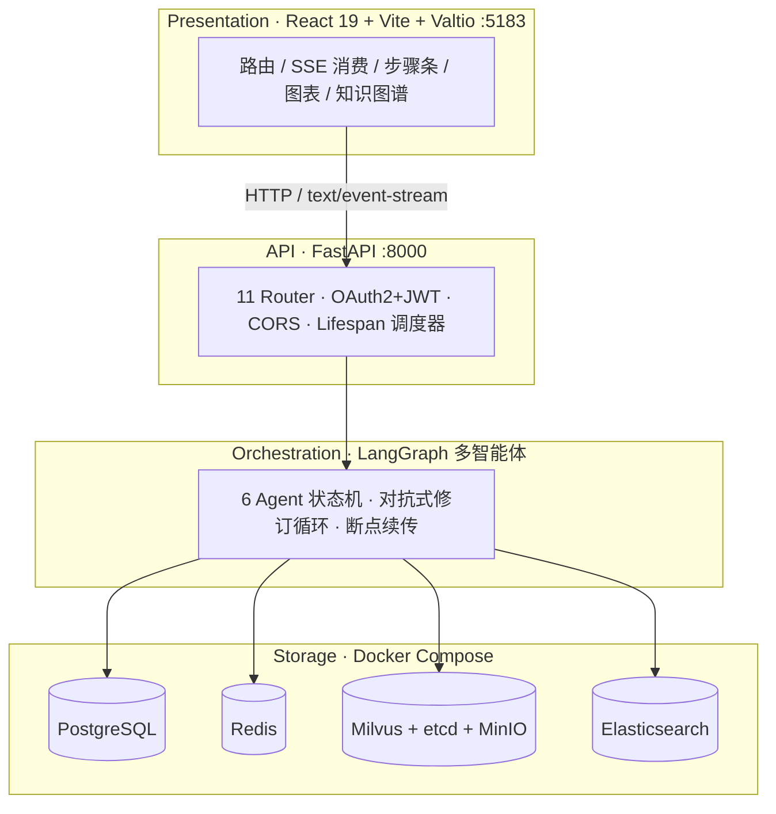
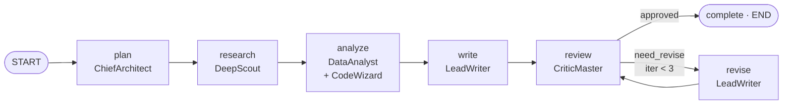
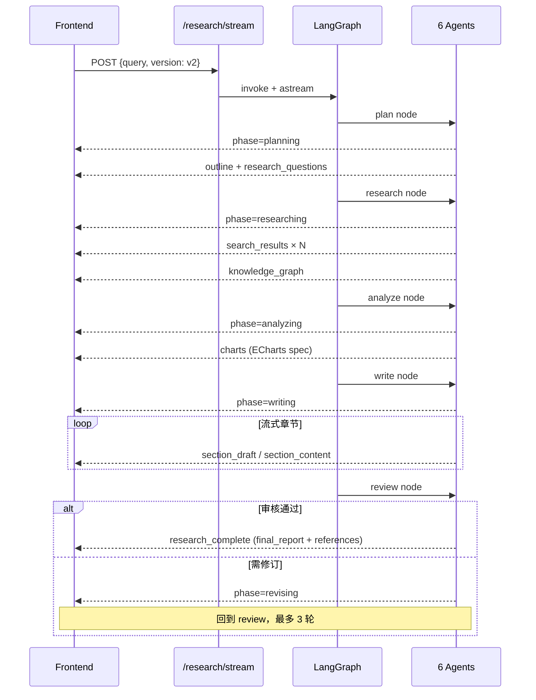

# 面试速查卡 — Deep Research V2

> 项目：industry-information-assistant · 创建：2026-04-26
> 用途：30-50 分钟技术面试 talk track + 现场 demo

完整架构见 `docs/design-docs/architecture.md`（482 行），本卡仅留**面试现场用得上的高密度内容**。

---

## A. 60 秒电梯介绍（背诵版）

> 我做了一个**面向行业研究的多智能体 Deep Research 系统**。核心是用 **LangGraph 编排 6 个角色化 Agent** —— 架构师拆问题、侦察兵搜信息、代码巫师做计算、分析师出图表、写手生成章节、审查官迭代修订。技术栈 FastAPI + React 19 + Milvus + Elasticsearch + PostgreSQL，全链路 SSE 流式输出，前端实时渲染**研究步骤条 / 知识图谱 / ECharts 图表 / 流式报告**。它解决的痛点是：传统 RAG 给一段答案就完了，但市场研究场景需要**可追溯过程 + 多源证据 + 自动可视化 + 对抗式质检**。

---

## B. 架构图（用于白板）

### B.1 四层模型

### B.2 LangGraph 状态机（核心，**必背**）

代码锚点：`backend/app/service/deep_research_v2/graph.py:206-233`

**关键点**：
- `add_conditional_edges` 在 review 节点：返回 `complete` 或 `revise`
- revise → review 是 **循环边**，由 review_node 内部计数器限制（≤3 次）
- 整图共享 `ResearchState`（typed dict），每个 node 是 async 函数返回 partial state

### B.3 SSE 事件流（前端聚合的 30+ 事件类型）

---

## C. 高频追问 · 答题骨架

### C.1 「为什么 6 个 Agent，不是 1 个大模型多轮 prompt」

- 每个 Agent **专属 system prompt + 专属工具集**：Scout 调 web_search/local_kb，Wizard 用 Python 沙箱执行计算，Critic 拿 Writer 输出做 fact-check
- **职责分离 → 可观测可调试**：研究失败可以定位到哪个 Agent 哪个 phase；单 Agent 做不到这种可控性
- **模型分配可异构**：架构师可以用强推理模型（qwen3-max），侦察兵用快搜模型；代码里 `config/llm_config.py` 配置每个 Agent 用什么模型

### C.2 「Agent 之间怎么协作 / 状态怎么传」

- `ResearchState` 是 LangGraph 的 typed state（`backend/app/service/deep_research_v2/state.py:237`），所有 Agent 读写同一份 state
- 每个 node 函数返回 partial state，LangGraph 自动 merge
- 跨 Agent 数据流：plan 写入 outline + research_questions → research 读 questions 写 search_results → analyze 读 results 写 charts → write 读 outline+results+charts 写 sections → review 读 sections 写 review_feedback

### C.3 「最难的部分是什么」（推荐答案）

**前端 SSE 事件聚合**（`frontend/src/pages/chat/index.tsx:1513`）：

- 30+ 事件类型，可能**乱序到达**（network jitter）、**部分覆盖**（同 stepType 多次更新）、**条件存在**（review 不一定触发 revise）
- `aggregatedResearchData` 用 `useMemo + ref` 维护跨 phase 的累积视图
- 设计上：用 `stepType` 作主键而非自增 id，确保事件可幂等合并
- 教训：一开始用过 stream index 做 key，结果 revise 循环时步骤条错乱 → 改成语义化 stepType 才稳

### C.4 「检索效果怎么评 / 报告事实准确性」

- **诚实回答**：当前 demo 阶段无量化指标
- 下一步规划：接 RAGAS 评 retrieval recall / answer faithfulness / context precision
- CriticMaster 已经做了**生成时的对抗式 fact-check**（`agents/critic.py:356`），但缺**离线 ground truth 集**做回归

### C.5 「为什么 SSE 不用 WebSocket」

- 单向 server→client 流式，HTTP/1.1 兼容好（含浏览器 EventSource）
- 可中断：前端 `AbortController` + 后端 Redis 取消标志（`research:cancel:<session_id>`）
- 无需会话保持，不占长连接资源；WebSocket 双向是过度设计

### C.6 「断点续传怎么做的」

- 每个 phase 完成后写 `ResearchCheckpoint` 到 PostgreSQL（`checkpoint_service.py`）
- 包含 ResearchState 快照 + 当前 phase
- API：`POST /research/resume/{session_id}` 从 checkpoint 恢复 → LangGraph 从对应 node 重新开始
- 用途：长研究中断（5-10 分钟级）、用户中途取消后回来继续

---

## D. 我做了什么 ✏️ **TODO：用户填**

> 把 6 Agent / 11 router / 9 前端页面里**哪些是你写的 / 哪些是协作的 / 哪些是别人写的**列清楚。被问到细节要能答到代码层。

| 模块 | 我的角色 | 关键决策 |
|---|---|---|
| _e.g. DeepScout (scout.py)_ | _主写_ | _搜索结果去重用 SimHash 不是嵌入相似度，原因…_ |
| ... | ... | ... |

---

## E. War Story 仓库 ✏️ **TODO：用户填 3 个**

每个故事三句话即可，但必须有 **root cause** 和 **怎么解决的**。

1. **性能类** — 例：Milvus 检索 P95 高 → 发现 collection 没建 IVF 索引，nlist 默认 16 → 改 256 后 P95 降 70%
2. **一致性 bug** — 例：revise 循环时步骤条错乱（参考 C.3）
3. **产品决策** — 例：DataAnalyst 一开始想直接 LLM 生 PNG → 改成生 ECharts spec，理由是前端可交互 / 可缩放 / 可二次编辑

---

## F. Demo 指标（真实跑测 · 2026-04-26）

> 命令：`backend/.venv/Scripts/python.exe tests/research_demo.py`
> 原始输出：`tests/research_demo_output.json`
> Query：「2026 年中国金融科技监管走向和重点机会」
> Session ID：`0221e4af-8c44-4ed8-9596-ceed9d0a4755`

### F.1 端到端指标

| 维度 | 实测值 | 解读 |
|---|---|---|
| **总耗时** | 24 分钟 13 秒（writing 末段 LLM 连接异常中断；前端 SSE 在 24min 之前一直流式可见） | 长查询是常态；这里展示「为什么 SSE 必须做」—— 用户不可能等 24 分钟看空白屏 |
| **SSE 事件总数** | 136 | 实测 14 种事件类型（见下表） |
| **多源检索深度** | 40 次 search_results · 累计抓取 ~200 篇网页 | DeepScout 启动了 source_tracing 递归（depth=2）→ 自动追溯权威信源 |
| **知识图谱** | 10 节点 / 11 边 | DeepScout 抽取实体关系 → 前端 ECharts 渲染 |
| **图表** | 2 个（DataAnalyst 生成 ECharts spec） | code_result 事件 3 次表示沙箱执行了 3 段 Python |

### F.2 阶段计时（Phase Timings）

| Phase | 耗时 | 占比 | Agent |
|---|---|---|---|
| Planning | 26.1s | 1.8% | ChiefArchitect |
| Researching | 349.3s（5min 49s） | 24.0% | DeepScout（多 LLM 调用 × 多 web search） |
| Analyzing | 143.6s（2min 24s） | 9.9% | DataAnalyst + CodeWizard |
| Writing | ~929s（写到挑战机遇/未来展望第 6 节时连接异常） | 64.0% | LeadWriter（每节单 LLM 调用 50-60s） |

**面试可讲点**：6 章节大纲，每章一次 LLM 调用，平均 55s × 6 ≈ 5.5 min 写作时间。这是**质量与延迟的取舍** —— Writer 用 qwen3-max 单次成稿，没用 sectional pipeline 并行（**改进项**）。

### F.3 自动生成的研究大纲（**面试可直接展示**）

ChiefArchitect 输出，6 个章节：

1. **市场概况**
2. **竞争格局**
3. **技术趋势**
4. **政策环境**
5. **挑战机遇**
6. **未来展望**

**面试可讲点**：这不是预设模板，是 LLM 根据 query「金融科技监管走向和机会」**动态规划**的研究结构。换 query「医疗健康 AI 应用」会得到完全不同的章节（如「合规边界」「典型场景」等）。

### F.4 SSE 事件类型分布（**展示 SSE 复杂度**）

| 事件类型 | 计数 | 用途 |
|---|---|---|
| `search_results` | 40 | 推送每次 web search 的源 |
| `action` | 27 | ReAct Agent 的工具调用 |
| `thought` | 26 | Agent 推理过程 |
| `observation` | 9 | 工具执行结果 |
| `research_step` | 7 | 步骤条状态更新 |
| `section_content` | 6 | 流式章节内容 |
| `phase` | 4 | 大阶段切换 |
| `knowledge_graph` | 4 | 增量图谱更新 |
| `search_progress` | 3 | 搜索进度 |
| `code` | 3 | 沙箱执行的 Python 代码 |
| `chart` | 3 | 单图表流式 |
| `charts` | 1 | 全图表批量 |
| `code_result` | 1 | 沙箱执行结果 |
| `outline` | 1 | 研究大纲产出 |
| `research_start` | 1 | 启动事件 |

**面试可讲点**：14 种事件不是设计出来就有的，是 Agent 实现过程中**逐步抽出来**的。讲 C.3 那个 SSE 聚合故事时，可以说「同一个 stepType（如 analyzing）会接收 search_progress + code + code_result + chart + charts 五种事件，前端必须按 stepType 而不是事件 id 做幂等合并」。

### F.5 已知中断（如实回答）

- 24 分 13 秒后 `LeadWriter` 在写第 6 节最后调 LLM 整合时报 `Connection error`
- **Root cause**：DashScope API 端 connection reset（不是我代码的 bug，是 LLM 服务商网络抖动）
- **怎么改**：Writer 应该按 section 独立写并落库，而不是一次写完才提交 → 中断也能恢复 80%+ 进度。**这是一个真实的改进项，可以在面试时主动提**。
- 同时 `checkpoint_service` 已经在 phase 边界存了 state，但**没有 section 级 checkpoint** → 改进路径明确

---

## G. 现场 Demo 流程（5 分钟）

1. 打开 http://localhost:5183/
2. 点「金融科技助手」（已加 D1 补丁，自动开启深度搜索）
3. 输入预设 query：「2026 年中国金融科技监管走向和重点机会」
4. **现场指给面试官看**：
   - 左侧步骤条实时跳：📋 规划 → 🔍 搜索 → 📊 分析 → ✍️ 写作 → 🔎 审核
   - 右侧 tab 切换：搜索来源 / 知识图谱 / 图表 / 过程报告
   - 完成后看引用列表、可下载报告
5. **杀手锏**：研究跑一半按「停止」→ 演示 Redis 取消标志 + checkpoint 保存 → 演示 Resume

---

## H. 反预设答案（避免被反问翻车）

| 别说 | 改说 |
|---|---|
| 「我们用了 RAG」 | 「混合检索：Milvus 向量 + ES 倒排 + PG 结构化 + Web Search，5 路融合」|
| 「LangChain 写的」 | 「LangGraph，因为要做条件分支和循环（revise loop），LangChain 的 chain 抽象不够」|
| 「调了 GPT」 | 「DashScope 兼容层调 qwen3-max，每个 Agent 模型可独立配置」|
| 「就是个 chat bot」 | 「不是 chat，是研究 pipeline。chat 是入口，产物是结构化报告 + 引用 + 图表 + 知识图谱」|
| 「没遇到什么难题」 | （死路一条）随时准备 C.3 那套 SSE 聚合的故事 |
